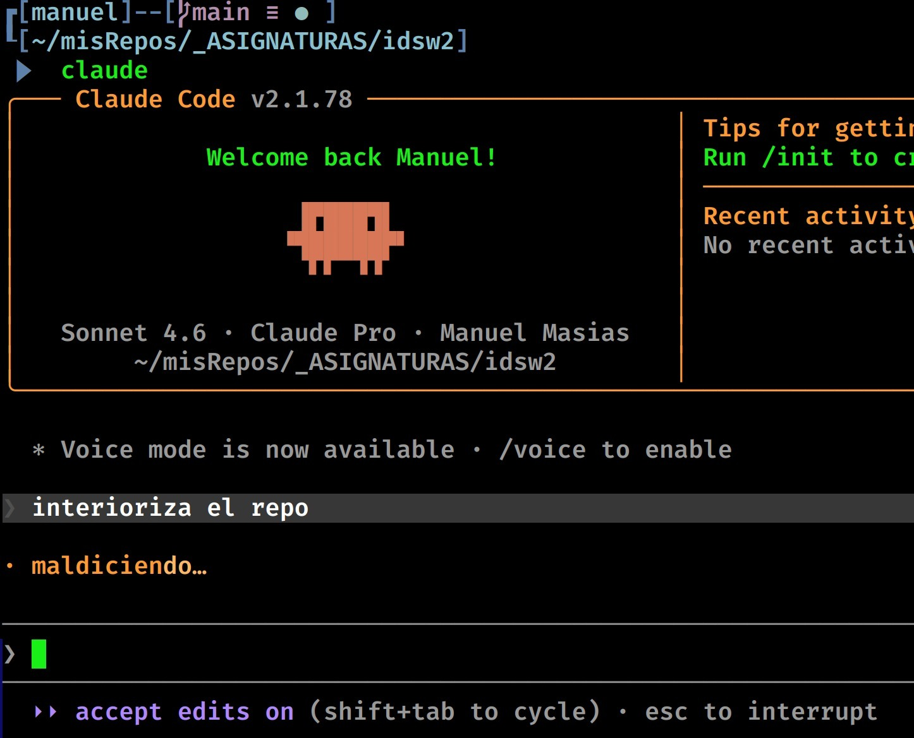
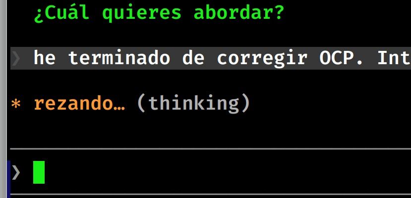
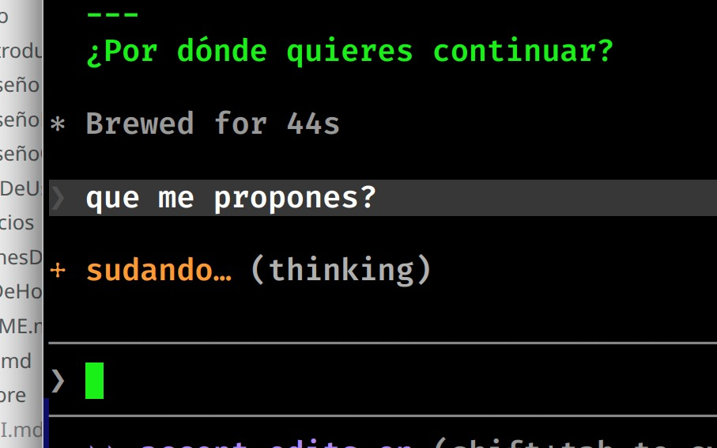
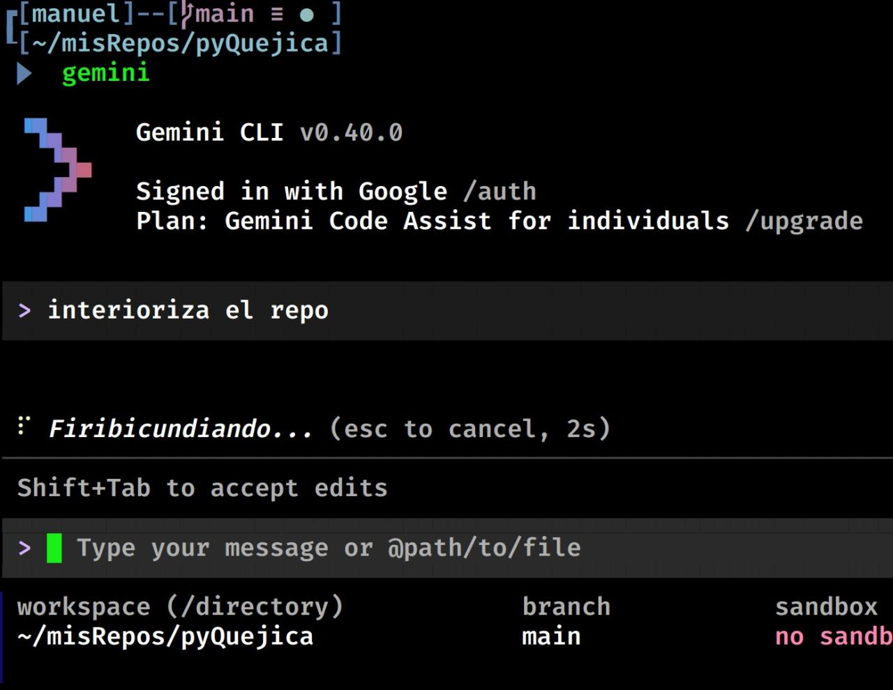

# pyQuejica (a.k.a. The Whiner Project)

Customize the *thinking labels* of Claude Code and Gemini CLI — those status messages that appear while the model is reasoning or executing tools — by replacing them with your own expressive verbs and phrases.

<div align=center>

||<br>||
|-|-|-|

</div>

The name comes from **Proyecto Quejica** (Project Whiner): the original idea of giving automatic vacuum cleaners a voice so they would clean while complaining.

> The scripts are idempotent: running them multiple times on already patched files won't cause any negative side effects.

## Requirements

- Python 3
- Claude Code installed (`claude`) and/or Gemini CLI installed (`gemini`), accessible in your PATH.

## Usage

### For Claude Code
```bash
# Applies the custom verbs defined in VERBS (Cursing, Grunting, Procrastinating...)
python3 patch_claude_verbs.py

# Show current verbs and restore the original ones
python3 patch_claude_verbs.py --status
python3 patch_claude_verbs.py --restore
```

### For Gemini CLI
```bash
# Applies custom status messages (Firibicundiando, Snooping around, Doing the dirty work...)
python3 patch_gemini_verbs.py

# Show patch status and restore backups
python3 patch_gemini_verbs.py --status
python3 patch_gemini_verbs.py --restore
```

## Customization

- **Claude:** Edit the `VERBS` list at the beginning of `patch_claude_verbs.py`.
- **Gemini:** Edit the `TRANSLATIONS` dictionary in `patch_gemini_verbs.py` to change which message replaces which.

## How it works

### Claude Code
The bundle (`cli.js`) contains an array of gerunds used for the thinking labels. The script locates the `return[...VAR,...q.verbs]` pattern in the minified bundle, identifies the variable name, and replaces its initialization with your custom list.

### Gemini CLI
The bundle is split into several `chunks`. The script explores the bundle directory looking for specific tool-related strings (like "Searching the web" or "Thinking") and replaces them with versions that have more personality (like "Snooping around the web" or "Firibicundiando").

## After updating your CLI tools
Every `npm` update overwrites the files and removes the patch. Simply run the scripts again (and delete the old `.bak` files if the script indicates they already exist).
